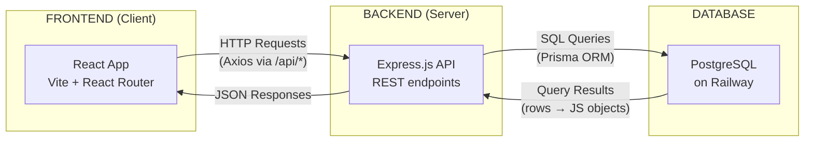
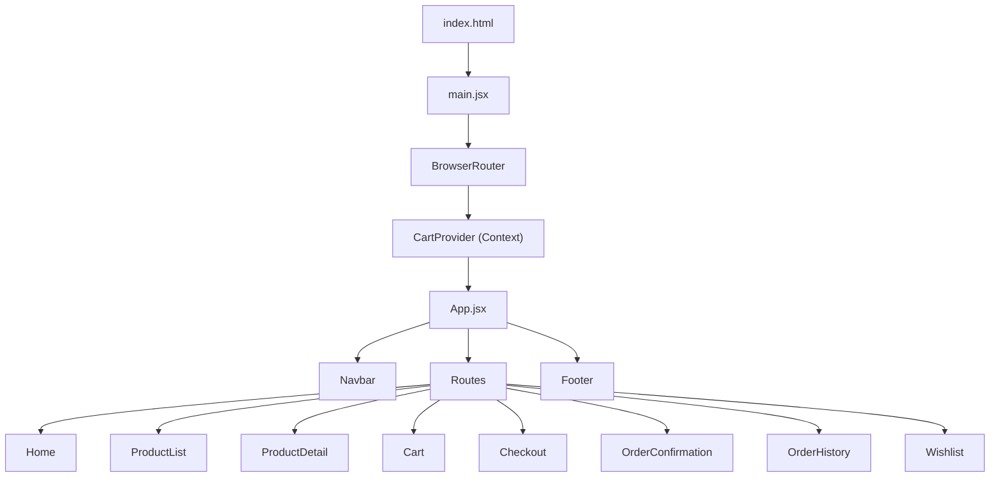
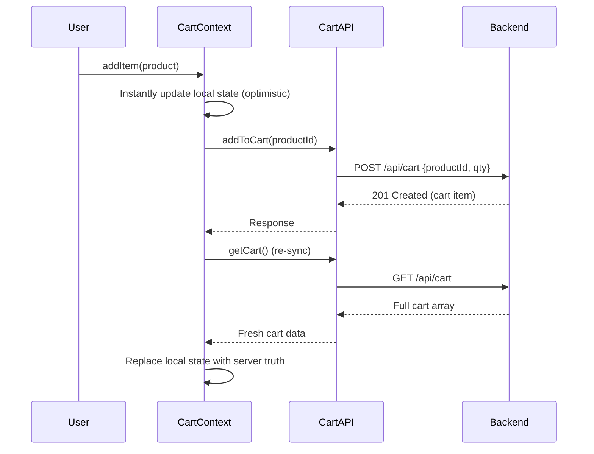
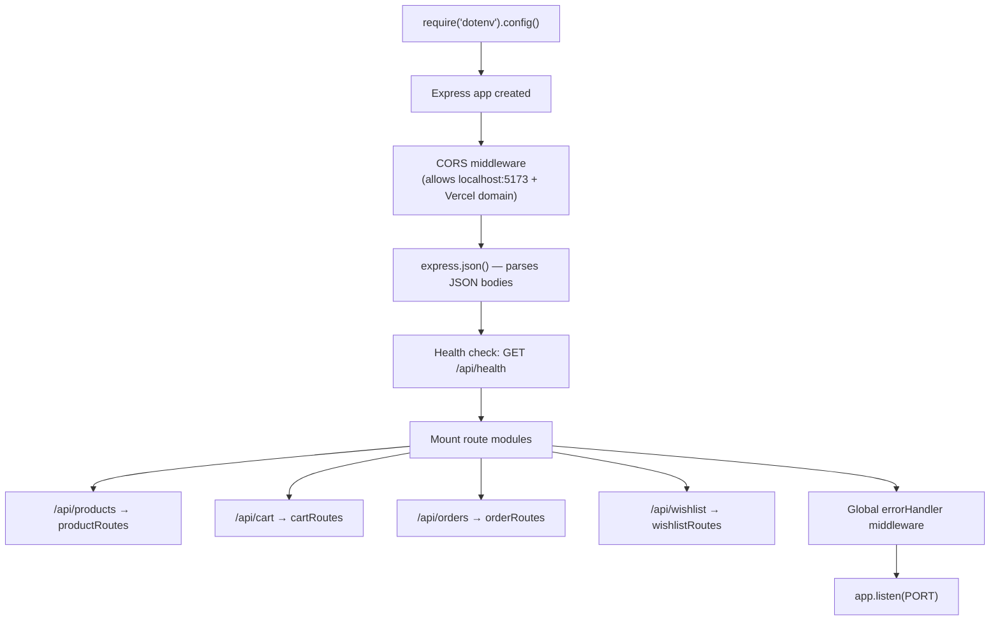
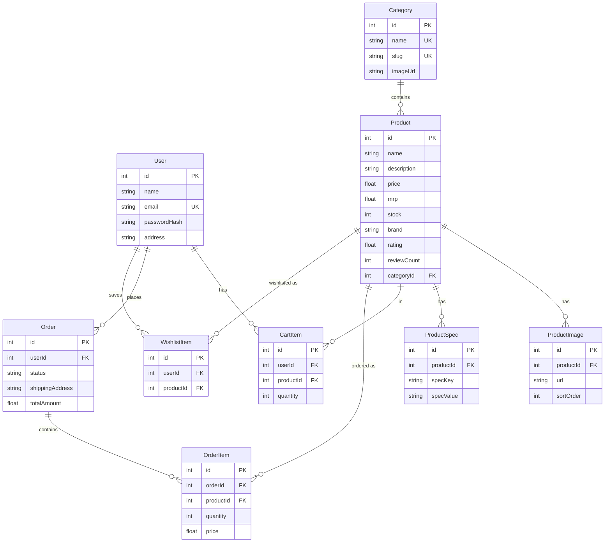
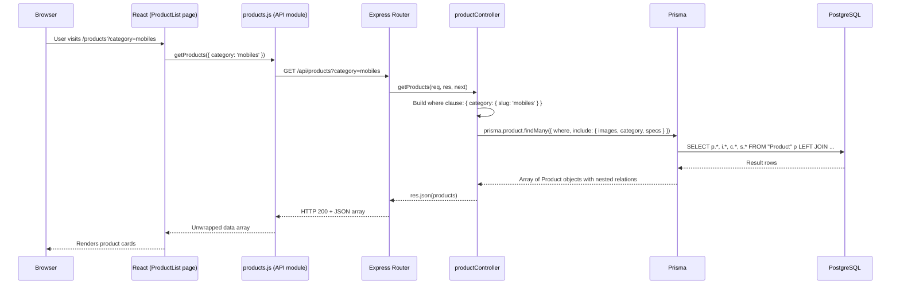
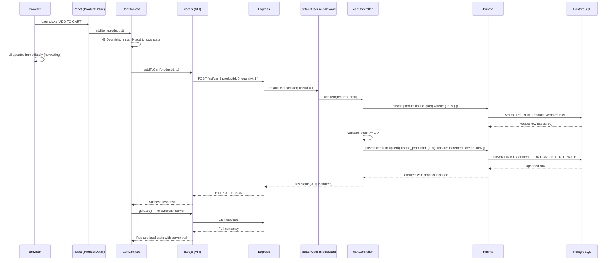
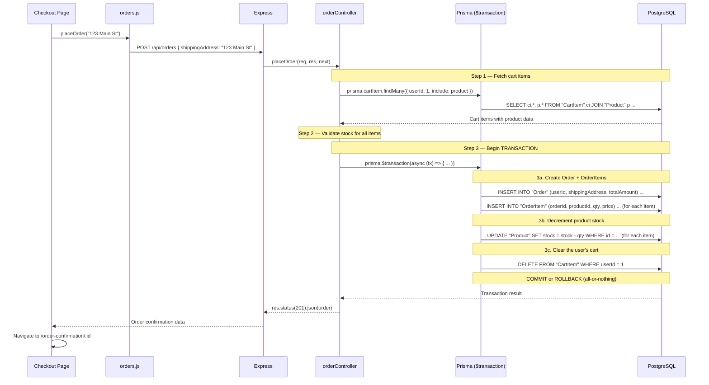
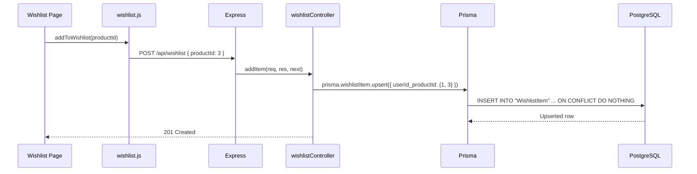
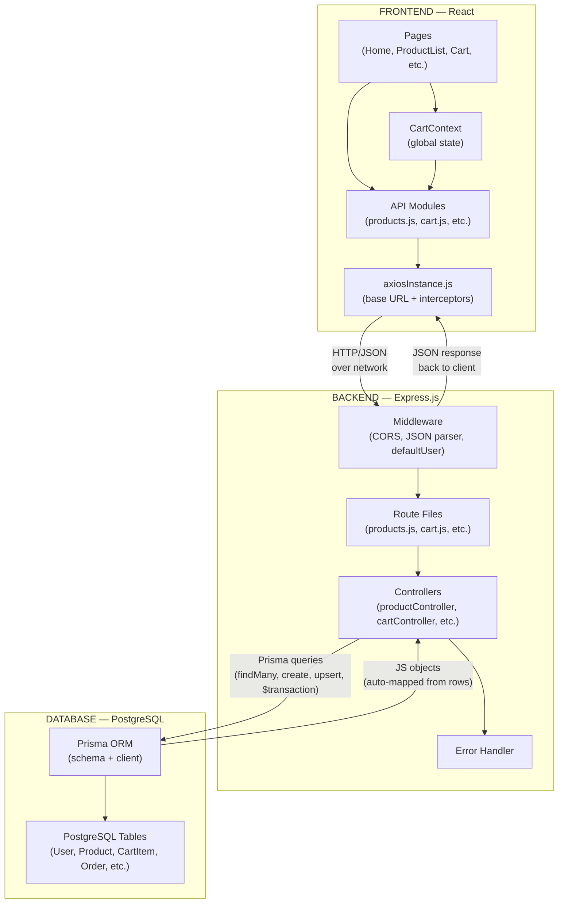

# Flipkart Clone — Architecture Deep Dive

## High-Level Architecture

Your project follows a **3-tier client-server architecture**:



| Layer | Technology | Hosted On | Role |
|-------|-----------|-----------|------|
| **Frontend** | React 18 + Vite + React Router | Vercel | UI rendering, routing, state management |
| **Backend** | Express.js (Node.js) | Render | REST API, business logic, data validation |
| **Database** | PostgreSQL | Railway | Persistent storage of all application data |
| **ORM** | Prisma | — | Type-safe database queries, migrations, schema |

---

## 1. The Frontend Layer

### Entry Point Chain



**Boot sequence:**
1. `index.html` loads the Vite-bundled JS
2. [main.jsx](file:///c:/Users/Welcome/Documents/Project%20fr/Flipkart%20clone/flipkart-clone/client/src/main.jsx) initializes React and wraps the app in:
   - `BrowserRouter` — enables client-side routing
   - `CartProvider` — provides cart state to all components via React Context
3. [App.jsx](file:///c:/Users/Welcome/Documents/Project%20fr/Flipkart%20clone/flipkart-clone/client/src/App.jsx) renders `Navbar`, a `<Routes>` block mapping 8 URL paths to page components, and `Footer`

### How the Frontend Talks to the Backend

The frontend uses a centralized **Axios instance** ([axiosInstance.js](file:///c:/Users/Welcome/Documents/Project%20fr/Flipkart%20clone/flipkart-clone/client/src/api/axiosInstance.js)) as the single HTTP gateway:

```javascript
// axiosInstance.js — the SINGLE gateway for all API calls
const API_URL = import.meta.env.VITE_API_URL || ''    // empty in dev (uses proxy)

const axiosInstance = axios.create({
  baseURL: `${API_URL}/api`,                           // all URLs start with /api
  headers: { 'Content-Type': 'application/json' },
})

// Interceptor: auto-unwraps response.data so components get plain JSON
axiosInstance.interceptors.response.use(
  (response) => response.data,          // success: return just the data
  (error) => Promise.reject(...)        // error: extract error message
)
```

> [!IMPORTANT]
> **Dev mode vs Production:** In development, Vite's dev server **proxies** `/api/*` requests to `http://localhost:5000` (configured in [vite.config.js](file:///c:/Users/Welcome/Documents/Project%20fr/Flipkart%20clone/flipkart-clone/client/vite.config.js)). In production, `VITE_API_URL` is set to the Render backend URL, and Axios sends requests directly.

### API Module Files

Each feature has its own thin API module that wraps Axios calls:

| File | Functions | Maps to Backend Route |
|------|-----------|----------------------|
| [products.js](file:///c:/Users/Welcome/Documents/Project%20fr/Flipkart%20clone/flipkart-clone/client/src/api/products.js) | `getProducts(params)`, `getProductById(id)`, `getCategories()` | `GET /api/products`, `GET /api/products/:id`, `GET /api/products/categories` |
| [cart.js](file:///c:/Users/Welcome/Documents/Project%20fr/Flipkart%20clone/flipkart-clone/client/src/api/cart.js) | `getCart()`, `addToCart()`, `updateCartQty()`, `removeFromCart()` | `GET/POST/PATCH/DELETE /api/cart` |
| [orders.js](file:///c:/Users/Welcome/Documents/Project%20fr/Flipkart%20clone/flipkart-clone/client/src/api/orders.js) | `placeOrder()`, `getOrders()`, `getOrderById()` | `POST/GET /api/orders` |
| [wishlist.js](file:///c:/Users/Welcome/Documents/Project%20fr/Flipkart%20clone/flipkart-clone/client/src/api/wishlist.js) | `getWishlist()`, `addToWishlist()`, `removeFromWishlist()` | `GET/POST/DELETE /api/wishlist` |

### Cart State Management (React Context)

[CartContext.jsx](file:///c:/Users/Welcome/Documents/Project%20fr/Flipkart%20clone/flipkart-clone/client/src/context/CartContext.jsx) is the only global state in the app. It uses **optimistic updates** — the UI updates instantly *before* the server confirms:



Key details:
- **On mount**: `CartProvider` fetches the full cart from the server via `GET /api/cart`
- **On add/update/remove**: UI updates instantly → API call fires → on success/failure, re-fetches from server to sync
- **Computed values** (`totalItems`, `subtotal`, `savings`) are derived from state, no extra API calls

---

## 2. The Backend Layer

### Server Boot & Middleware

[index.js](file:///c:/Users/Welcome/Documents/Project%20fr/Flipkart%20clone/flipkart-clone/server/src/index.js) bootstraps the Express server:



### Middleware Pipeline

Every request passes through middleware before reaching a controller:

| Middleware | File | What It Does |
|-----------|------|--------------|
| **CORS** | Built-in (Express) | Allows requests from `localhost:5173` (dev) and `flipkart-clone-garg.vercel.app` (prod) |
| **express.json()** | Built-in (Express) | Parses incoming JSON request bodies into `req.body` |
| **defaultUser** | [defaultUser.js](file:///c:/Users/Welcome/Documents/Project%20fr/Flipkart%20clone/flipkart-clone/server/src/middleware/defaultUser.js) | Sets `req.userId = 1` for all cart/order/wishlist routes (simulates authentication) |
| **errorHandler** | [errorHandler.js](file:///c:/Users/Welcome/Documents/Project%20fr/Flipkart%20clone/flipkart-clone/server/src/middleware/errorHandler.js) | Catches any unhandled errors, logs the stack trace, returns a JSON error response |

> [!NOTE]
> The `defaultUser` middleware is applied only to cart, order, and wishlist routes (not products). It substitutes for JWT authentication — in a production app, this would decode a Bearer token and extract the real user ID.

### Route → Controller → Database Flow

Each feature follows the same **3-layer pattern**:

```
Route file (defines HTTP method + URL)
  → Controller function (business logic)
    → Prisma query (database interaction)
```

---

## 3. The Database Layer

### Prisma ORM — The Bridge Between Backend & Database

[db.js](file:///c:/Users/Welcome/Documents/Project%20fr/Flipkart%20clone/flipkart-clone/server/src/config/db.js) creates a single Prisma client instance shared across all controllers:

```javascript
const { PrismaClient } = require('@prisma/client');
const prisma = new PrismaClient();    // connects to DATABASE_URL from .env
module.exports = prisma;
```

Every controller imports this `prisma` object and calls methods like `prisma.product.findMany()`, which Prisma translates into SQL queries.

### Database Schema (ER Diagram)

The [schema.prisma](file:///c:/Users/Welcome/Documents/Project%20fr/Flipkart%20clone/flipkart-clone/server/prisma/schema.prisma) file defines 8 models:



### Key Database Relationships

| Relationship | Type | Explanation |
|-------------|------|-------------|
| User → CartItem | One-to-Many | Each user has their own cart items |
| User → Order | One-to-Many | Each user can place multiple orders |
| User → WishlistItem | One-to-Many | Each user can wishlist multiple products |
| Category → Product | One-to-Many | Each category contains multiple products |
| Product → ProductImage | One-to-Many | Each product has multiple images (cascade delete) |
| Product → ProductSpec | One-to-Many | Each product has multiple specs (cascade delete) |
| Order → OrderItem | One-to-Many | Each order contains multiple line items |
| CartItem | Unique(userId, productId) | A user can only have one cart entry per product |
| WishlistItem | Unique(userId, productId) | A user can only wishlist a product once |

---

## 4. Complete Request Lifecycle — Feature by Feature

### Feature 1: Browsing Products



### Feature 2: Adding to Cart (with Optimistic Updates)



### Feature 3: Placing an Order (Database Transaction)

This is the most complex flow — it uses a **Prisma transaction** to ensure atomicity:



> [!IMPORTANT]
> The `$transaction` ensures that **either all 3 operations succeed together (create order + decrement stock + clear cart) or none of them happen**. This prevents issues like an order being created without stock being decremented.

### Feature 4: Wishlist



> [!NOTE]
> The `upsert` with an empty `update: {}` is a clever pattern — it means "create if not exists, do nothing if it already exists". This prevents duplicate wishlist entries without throwing errors.

---

## 5. How Data Flows Between All Three Layers — Summary



### Data Transformation at Each Layer

| Step | What Happens | Example |
|------|-------------|---------|
| **1. User action** | Click, form submit, page load | User clicks "Add to Cart" |
| **2. React component** | Calls API module function | `cartApi.addToCart(5, 1)` |
| **3. API module** | Uses Axios to make HTTP request | `axios.post('/cart', { productId: 5, quantity: 1 })` |
| **4. Axios interceptor** | Prepends base URL, sets headers | Full URL: `http://localhost:5000/api/cart` |
| **5. Vite proxy (dev only)** | Forwards `/api/*` to port 5000 | Transparent to application code |
| **6. Express middleware** | Parses JSON body, sets `req.userId` | `req.body = { productId: 5, quantity: 1 }`, `req.userId = 1` |
| **7. Route** | Dispatches to correct controller function | `POST /api/cart` → `cartController.addItem` |
| **8. Controller** | Validates input, calls Prisma | Checks product exists and has stock |
| **9. Prisma** | Translates JS method call → SQL | `prisma.cartItem.upsert(...)` → `INSERT ... ON CONFLICT DO UPDATE` |
| **10. PostgreSQL** | Executes SQL, returns rows | Row inserted/updated in `CartItem` table |
| **11. Prisma** | Maps SQL rows → JS objects | `{ id: 7, userId: 1, productId: 5, quantity: 1, product: {...} }` |
| **12. Controller** | Sends JSON response | `res.status(201).json(item)` |
| **13. Axios interceptor** | Unwraps `response.data` | Component receives plain JS object, not Axios wrapper |
| **14. React component** | Updates state → re-render | Cart badge shows updated count |

---

## 6. API Endpoints — Complete Reference

| Method | Endpoint | Auth? | Request Body | Controller | Prisma Operation | Response |
|--------|----------|-------|-------------|-----------|-----------------|----------|
| `GET` | `/api/products` | ❌ | — (query: `?search=&category=`) | `getProducts` | `product.findMany` with filters | Array of products |
| `GET` | `/api/products/categories` | ❌ | — | `getCategories` | `category.findMany` | Array of categories |
| `GET` | `/api/products/:id` | ❌ | — | `getProductById` | `product.findUnique` | Single product |
| `GET` | `/api/cart` | ✅ | — | `getCart` | `cartItem.findMany` | Array of cart items |
| `POST` | `/api/cart` | ✅ | `{ productId, quantity }` | `addItem` | `cartItem.upsert` | Created/updated item |
| `PATCH` | `/api/cart/:productId` | ✅ | `{ quantity }` | `updateItem` | `cartItem.update` | Updated item |
| `DELETE` | `/api/cart/:productId` | ✅ | — | `removeItem` | `cartItem.delete` | Success message |
| `POST` | `/api/orders` | ✅ | `{ shippingAddress }` | `placeOrder` | `$transaction` (create + update + delete) | Created order |
| `GET` | `/api/orders` | ✅ | — | `getOrders` | `order.findMany` | Array of orders |
| `GET` | `/api/orders/:id` | ✅ | — | `getOrderById` | `order.findFirst` | Single order |
| `GET` | `/api/wishlist` | ✅ | — | `getWishlist` | `wishlistItem.findMany` | Array of wishlist items |
| `POST` | `/api/wishlist` | ✅ | `{ productId }` | `addItem` | `wishlistItem.upsert` | Created item |
| `DELETE` | `/api/wishlist/:productId` | ✅ | — | `removeItem` | `wishlistItem.delete` | Success message |

> [!NOTE]
> "Auth" here means the `defaultUser` middleware runs. Currently it hardcodes `userId = 1`, but the architecture is ready for real JWT auth — just swap the middleware.

---

## 7. Key Design Patterns Used

| Pattern | Where | Why |
|---------|-------|-----|
| **Separation of Concerns** | Routes vs Controllers vs Models (Prisma) | Each layer has one job — routing, logic, or data access |
| **Optimistic Updates** | CartContext | Instant UI feedback; re-syncs with server after API call |
| **Centralized HTTP Client** | axiosInstance.js | Single place to configure base URL, headers, error handling |
| **Database Transactions** | orderController.placeOrder | Atomic operations — order creation + stock decrement + cart clearing |
| **Upsert Pattern** | Cart & Wishlist | "Create if not exists, update if exists" — avoids duplicate checks |
| **Proxy in Development** | vite.config.js | Avoids CORS issues in dev; same-origin requests |
| **Environment Variables** | `.env` / `.env.production` | Different configs for dev vs production without code changes |
| **Cascade Delete** | ProductImage, ProductSpec | Automatically clean up child records when a product is deleted |
| **Global Error Handler** | errorHandler middleware | Catches all unhandled errors, returns consistent JSON error format |
